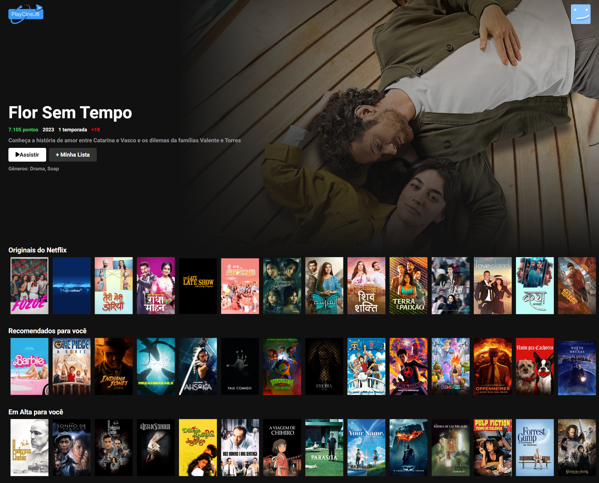
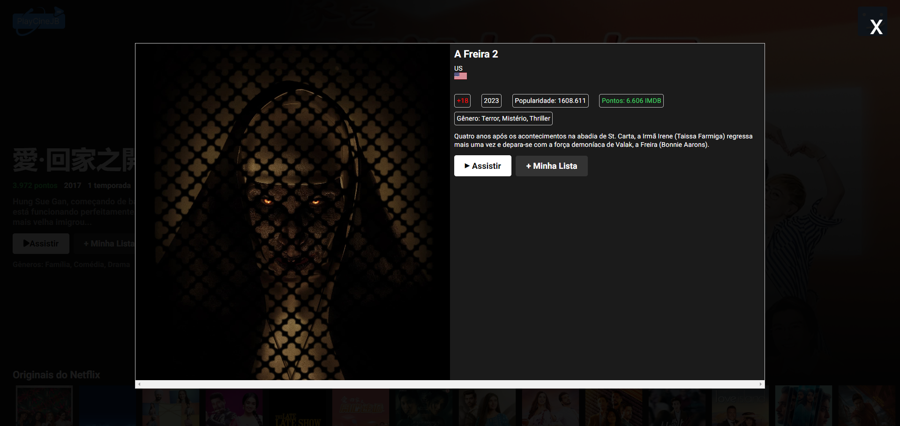

# Clone do Netflix em React

Este é um projeto de clone do serviço Netflix, desenvolvido usando React. O objetivo deste projeto é replicar a página inicial do site Netflix, incluindo suas funcionalidades e layout.

## Funcionalidades

- Navegação entre filmes e séries populares.
- Carrosséis de destaque com categorias variadas.
- Modal para cada filme ou serie.
- Responsividade para diferentes tamanhos de tela.

## Tecnologias Utilizadas

- React
- React Router
- Styled Components
- Axios
- React Flags Select
- React word flags
- HTML5
- CSS3

## Como Executar

1. Clone este repositório: `git clone https://github.com/JoaoSBarbosa/playcinejb.git`
2. Acesse a pasta do projeto: `cd nome-do-repositorio`
3. Instale as dependências: `npm install`
4. Execute o projeto: `npm start`
5. O projeto estará disponível em: `http://localhost:3000`

## Screenshots

## Contribuição

Contribuições são bem-vindas! Sinta-se à vontade para abrir uma issue ou enviar um pull request.
